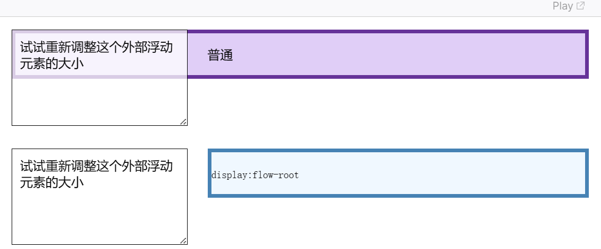

### 区块格式化上下文
 格式化上下文影响布局，通常，我们会为定位和清除浮动创建新的 BFC，而不是更改布局，因为它将
 1. 包含内部浮动。
 2. 排除外部浮动。
 3. 阻止外边距重叠。

 * 包含内部浮动。
   也就是包含内部浮动元素的高度，阻止外部元素高度塌陷

 * 排除外部浮动。
   BFC元素不会与外部的浮动元素重叠， 也就是
   

 * *阻止外边距重叠。
   BFC元素和其他元素（包括和其他BFC元素）之间不会发生边距重叠。也就是说，并不是BFC元素内部的元素不会发生margin重叠。

### 创建BFC的方式
  1. 浮动元素（Float不为 none）
  2. overflow 值不为 visible 或 clip 的块级元素。（如overflow:hidden，scroll等
  2. 行内块元素（display：inline-blokc）
  3. 弹性元素（display：flex
  4. 网格元素（display：grid