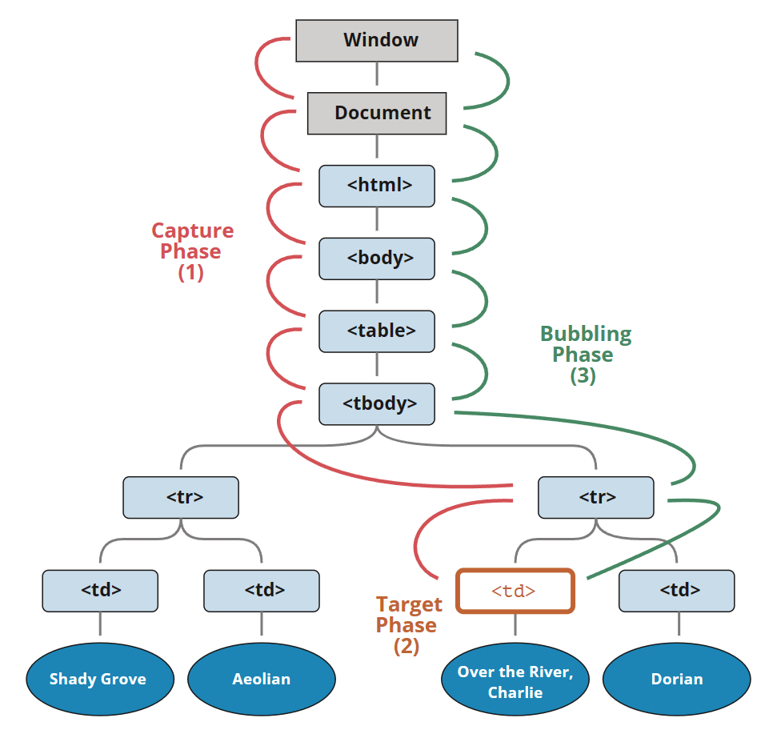

#### 事件处理的阶段
  DOM事件标准描述了事件传播的3个**阶段**：
  1. 捕获阶段（Capturing phase）—— 事件（从 Window）向下走近元素。
  2. 目标阶段（Target phase）—— 事件到达目标元素。
  3. 冒泡阶段（Bubbling phase）—— 事件从元素上开始冒泡。
  以上阶段依次发生。“捕获”阶段很少在实际开发中被使用。
 
* 常用方法
  - preventDefault:取消事件的默认行为;
  - stopPropagation:阻止事件冒泡;

> 可以使用addEventListener()方法观察阶段发生的顺序

```html
// HTML 
  <div id="dv1">
    <div id="dv2">
      <div id="dv3">
        click
      </div>
    </div>
  </div>
  
  //JS
  <script>
  dv1 = document.getElementById('dv1');
  dv2 = document.getElementById('dv2');
  dv3 = document.getElementById('dv3');
  
  dv1.addEventListener('click', ()=>{console.log('冒泡', 'div1'); });
  dv2.addEventListener('click', ()=>{console.log('冒泡', 'div2'); });
  dv3.addEventListener('click', ()=>{console.log('冒泡', 'div3'); });
  
  dv1.addEventListener('click', ()=>{console.log('捕获', 'div1'); }, true);
  dv2.addEventListener('click', ()=>{console.log('捕获', 'div2'); }, true);
  dv3.addEventListener('click', ()=>{console.log('捕获', 'div3'); }, true);
  </script>
  
  //Console
  捕获 div1
  捕获 div2
  捕获 div3
  冒泡 div3
  冒泡 div2
  冒泡 div1
```
