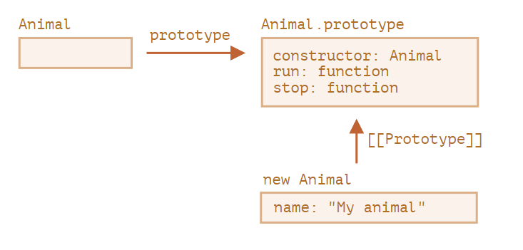
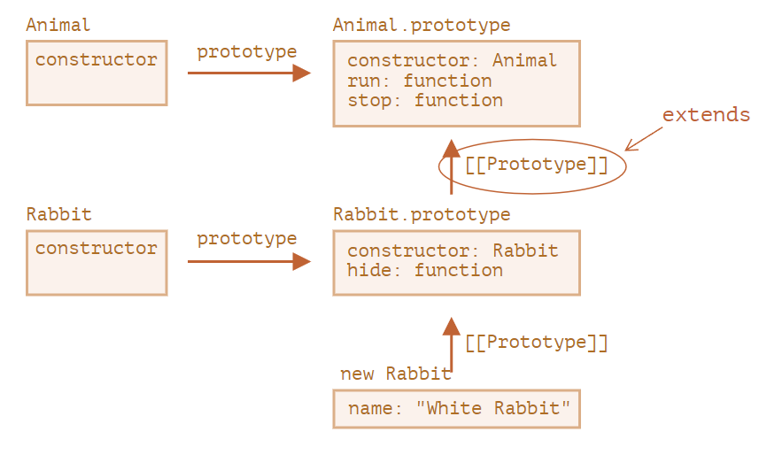
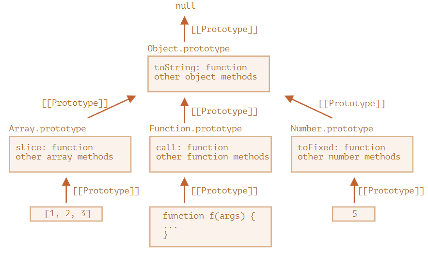

## Javascript中普通对象的原型

JavaScript 中所有的对象都有一个内置属性，称为它的 prototype（原型）。它本身是一个对象，故原型对象也会有它自己的原型，逐渐构成了原型链。原型链终止于拥有 null 作为其原型的对象上。

> 备注： 指向对象原型的属性并**不**是 `prototype`。它的名字不是标准的，但实际上所有浏览器都使用 `__proto__`。访问对象原型的*标准方法*是 `Object.getPrototypeOf()`。

```
   class Animal { 
      constructor(name) { this.name = name; }
   }
   let animal = new Animal("My animal");
```
   实例 `animal` 和class `Animal`的图形化表示
   

```
   const myDate = new Date();
   let object = myDate;

   do {
    object = Object.getPrototypeOf(object);
    console.log(object);
   } while (object);

   // Date.prototype
   // Object { }
   // null
```


## extend怎么实现继承的
  1. extends语法糖做的事
  
  
  2. 手动实现继承，也就是原型链和调用构造函数的组合方法实现继承，做的事
  

  * Javascript内建对象同样也使用原型继承实现。例如，`Date.prototype.[[Prototype]]` 是 `Object.prototype`。
  

## 手动实现继承
  **总结写在前面**：实现继承的关键是实现两个点，一是继承属性，最好是子类能获得独立的属性。二是继承方法，最好是子类共用父类的方法。

  1. 原型链继承
    ```
      SubType.prototype = new SuperType();
    ```
    * 可以访问父类的原型链。
    * 所有子类共享父类的引用类型属性。
  
  2. 调用构造函数
    ```
      function SuperType(name){ this.name=name; }

      function SubType(){
        SuperType.call(this, name);
      }
    ```
    * 优点：每个实例会拥有独立的父类中的属性和方法
    * 缺点：但由于不能访问原型链，所以要被继承的方法只能在*父类的构造函数*中定义和实现，而*不能在父类的原型中*定义。因此父类中的方法无法复用，子类也不能访问父类原型上的方法。
   
  3. 组合继承
    ```
      function SubType (){
        //继承属性
        SuperType.call(this);  //第二次调用
      }
  
      //继承方法
      SubType.prototype = new SuperType(); //第一次调用
    ``` 
    * 优点：让子类有自己的属性，同时还共享父类的方法，实现了父类方法的复用。
    * 缺点：调用两次父类的构造函数，且有两组属性

   4. 原型式继承
     实质上是对传入的父对象进行了一个浅拷贝。
     ```
       function object(o){ // o是一个对象实例
         function F(){};
         F.prototype = o;
         return new F();
       }
     ```
    * 优点：适用于*不需要单独创建构造函数*的情景。已经由Object.create()方法标准化。
    * 缺点：引用值属性会在所有子类中共享

   5. 寄生式继承
     思路与*调用构造函数继承*接近。利用原型式继承返回的对象，以某种方式增强这个对象。
     ```
       function createAnother(original){
         let clone = object(original);
         clone.sayHi=function(){ …… };
         return clone;
       }
     ```
     * 优点：
     * 缺点：基于类似的原因导致函数难以重用，且引用值属性会在所有子类中共享
   
   6. 寄生式 组合继承

     > 是通过 **调用构造函数**的方法继承父类的属性，然后通过**混合原型链**的方法继承父类的函数。
     > 基本思路是不通过调用父类构造函数给子类原型赋值，而是取得*父类原型*的一个副本。说到底就是使用寄生式继承来继承*父类原型*，然后将返回的新对象赋值给子类原型。
     ```
       function inheritPrototype(subType, superType) { 
         // 因为按原型链的查找只会找到原型上，所以拷贝父类的原型即可，而不是拷贝父类
         let prototype = object(superType.prototype); // 创建对象

         prototype.constructor = subType; // 增强对象 
         
         subType.prototype = prototype; // 赋值对象
       }
     ```
     寄生式 组合继承的方式：
     ```
       function SuperType(name) { 
         this.name = name; 
         this.colors = ["red", "blue", "green"]; 
       } 
       
       SuperType.prototype.sayName = function() { 
         console.log(this.name); 
       }; 
       
       function SubType(name, age) { 
         SuperType.call(this, name); //★★ 调用构造函数，已经实现了属性继承
         this.age = age; 
       } 
       
       inheritPrototype(SubType, SuperType);  //★★

       SubType.prototype.sayAge = function() { 
         console.log(this.age); 
       };
     ```
     这里只调用了一次 SuperType 构造函数（将为了继承原型链上的那次调用，换成了对临时对象调用构造函数，认为临时对象是空的，开销小的），避免了 SubType.prototype 上不必要也用不到的属性，因此可以说这个例子的效率更高。