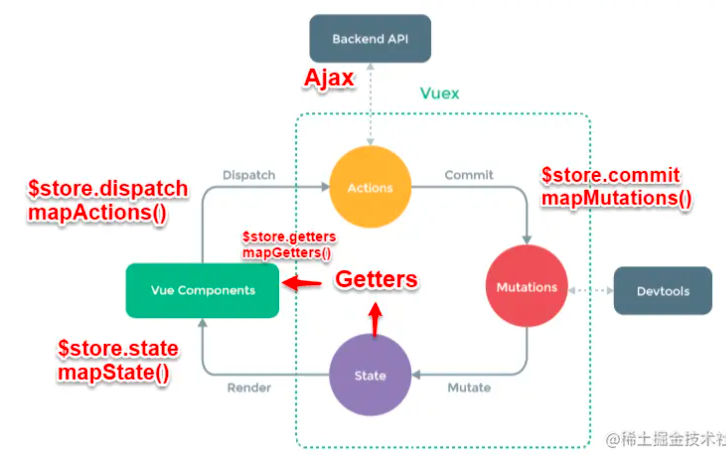

### 父子组件之间
  父组件通过v-on将属性值传递给子组件。 相应地，子组件使用 `props` 显式定义属性。

  子组件向父组件传递数据，通过调用 `$emit` 出发自定义事件。在参数中包含数据传给父组件。

  父组件调用子组件的方法：父组件在使用子组件的时候设置 `ref`，通过`$ref`调用子组件的方法。

### 通用的（或更复杂的组件关系之间）的通信
  VUEX 作用相当于一个用来存储共享变量的容器
  * VUEX主要包括三个对象，`State`、`Actions` 和 `mutations`。
    * `State`用来存放共享变量
    * `mutations` 存放修改 `State` 的方法
    * `actions` 也用来存放修改变量的方法，在mutations的基础上进行。常用来做一些**异步操作**.
     