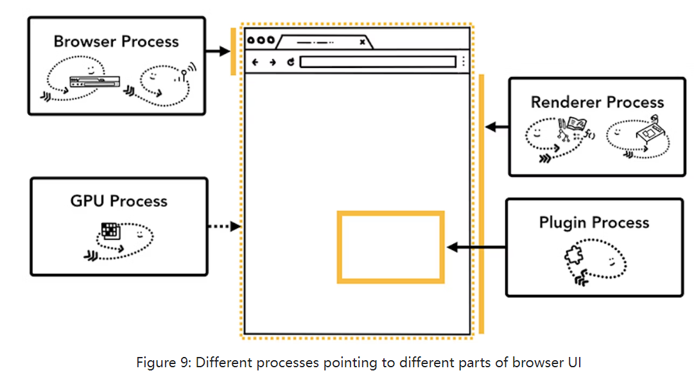

### 浏览器内部的进程和线程
#### 进程
1. 最顶部的是浏览器进程（browser process），它负责与其他进程互相协调。控制“chrome”的应用部分，包括地址栏，书签，前进和后退按钮。同时也负责不可见的部分，包括网络请求和文件访问。
2. 渲染进程（render process），会**创建多个**并**分配给每个标签页**
3. 插件进程（plugin process），控制任何网页使用到的插件，如flash
4. GPU进程，负责独立于其他进程的GPU任务。GPU进程会拆分成多个，分配到不同的app，最后将多个app的任务绘制到同一个屏幕上
5. ……

* 标签页独立渲染进程的好处
为每个标签页分配一个渲染进程，有利于在个别标签页没有响应时，还能保持其他标签页的运行。同时有利于每个站点的安全。  

当资源不足时，会合并渲染进程，同站点的标签页共用一个渲染进程。

* 节省更多内存
对于浏览器进程，也是类似的处理，chrome会将多个功能区分到不同的进程处理，但资源不足时合并

#### 线程
- 浏览器进程包含：
 - UI线程，绘制按钮和输入框等
 - 网络线程，处理而网络栈，接收数据
 - 存储线程
- 渲染进程包含：
 - 主线程
 - 合成器线程
 - 光栅线程 

### 简单的导航
1. 地址栏输入的URL首先由 *UI线程* 处理
2. 开始导航。*UI线程* 初始化一个网络调用。*网络线程* 会执行相应的协议，发送网络请求，如DNS， TLS等。（HTTPS（HTTP Secure）就是基于 TLS 的安全的 HTTP 协议）。如果遇到重定向响应，则联系 *UI线程*，重新创建请求。
3. 读取响应。*网络线程* 判断响应报文类型，若是HTML文档，则传递数据到 *渲染进程*。若是压缩文件，则启动下载管理。
   > 这个时候也是安全检查发生的阶段，找出恶意网站。同时也有CORB（Cross Origin Read Blocking）检查。
4. 找一个渲染进程。确保数据安全后，*网络线程* 联系 *UI进程* 找一个 *渲染进程*。
   > 由于网络请求可能要花费上百毫秒，在网络线程发出请求的同时（步骤2），UI线程会开始确定一个可用的渲染进程，提前等待数据到来。
5. 提交导航。数据和 *渲染进程* 都准备好后，*浏览器进程* 发信息通知 *渲染进程* 提交导航，同时发送HTML数据。一旦浏览器进程收到确认（渲染进程提交导航），则导航完成，文档加载阶段开始。

* 导航结束后，渲染进程继续加载资源和渲染页面。在渲染结束后，渲染进程通知浏览器进程（在页面的所有 `onload`事件触发并执行完毕之后），此时 *UI线程* 停止tab上的旋转图标。

* 从当前页面导航到另一个网页的步骤，浏览器进程会做同样的事，但在这之前，它会先确认渲染进程没有发来 `beforeunload`事件。之后的导航和上述不同之处仅在导航请求是从渲染进程发送到浏览器进程，而不是UI线程。

### 渲染进程的内部
渲染进程处理所有标签页内部发生的事。在渲染进程内，主线程（main thread）处理大部分的代码，有时，worker 线程也会处理一部分代码。
合成器线程和光栅线程也在渲染进程内渲染页面。

渲染进程的核心工作就是将HTML、CSS和Javascript文件转换为可交互页面。

1. 解析
* DOM树构建。导航提交后，*主线程* 开始解析HTML，构建Document Object Model（DOM）
* 子资源加载，额外的资源，如图片，css文件等。通常会使用“preload scanner” 加速。对于 `` `<link>`，会使用预加载。
* JavaScript会阻塞解析。解析时遇到 `<script>`标签，解析会在此处停止，进而执行JavaScript代码。因为JavaScript会修改DOM树的结构，因此HTML解析需要等待Javascript执行。
2. 提示浏览器如何加载资源。例如使用 `async`或 `defer`，提是浏览器不阻塞HTML解析的方式加载JavaScript脚本。`<link rel="preload">`的方法，告知该资源需要尽快加载。
3. 样式计算。*主线程* 解析css文件，确定每个DOM节点的样式
4. 布局。*主线程* 遍历前两布的结果，构建布局树。得到布局树，其结构与 DOM 树类似，但它只包含与页面上可见的内容相关的信息。
> 如果一个元素应用了 `display: none`，则该元素不是布局树的一部分（但是，一个 `visibility: hidden` 元素在布局树中）。同样，如果一个具有类似 `p::before{content:"Hi!"}` 内容的伪类，则该伪类将包含在布局树中，即使该伪类不在 DOM 中也是如此。
5. 绘制Painting：主线程遍历布局树，创建绘制记录（paint records/paint trees），其中包含了绘制过程的记录，如“先画背景、后文字、然后矩形”。